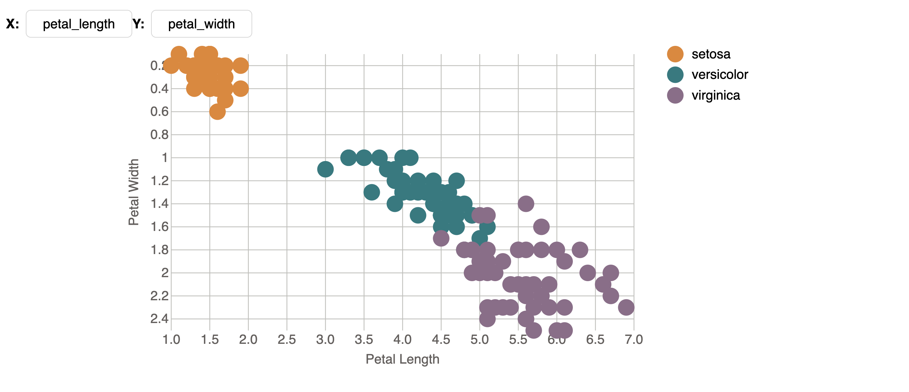

# Interactive Scatter Plot with dropdown menu

This folder contains the scatter plot visualization using React, D3 and tailwind.

## Description

This scatter plot visualizes the famous iris dataset to show the relationship between multiple attributes.
This interactive plot uses dropdown menu to allow users to select different attributes.

### New UI component

- Dropdown components using shadcn: https://ui.shadcn.com/docs/components/dropdown-menu
- Legend components to show different types of flowers

To render the image and explore the interactive feature of this plot, you can use http://localhost:3000/scatterplot_menu
